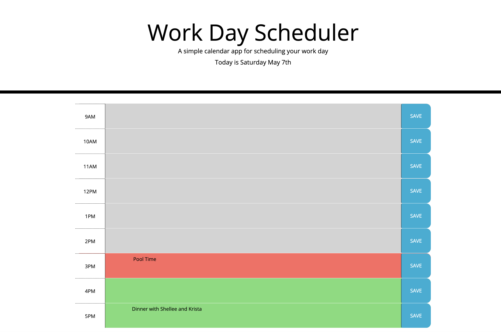

# Work Day Scheduler 

## Purpose 
Provide myself with a daily calendar to see what I need to achieve and where I am at in the day

## Problems Solved 
Time is such a tricky thing. Getting the correct classes to add to a timeblock when you are in the PM was difficult. To solve this problem I changed my class ID's, my array of class id's, and the time I was calling from momentJS into military time or 24hr clock. This made class implementation much easier. 

## Lessons Learend 
How to use JQuery to access elements and using the sibling/parent relationship. 

## Built with 
* HTML 
* CSS 
* Javascript 
* Jquery 
* MomentJS 

# Deployed Site 
 https://clarkspencerc.github.io/super-disco/

## Screenshots 
Starting Screen
)

## Contribution 
Made by Spencer Clark 

